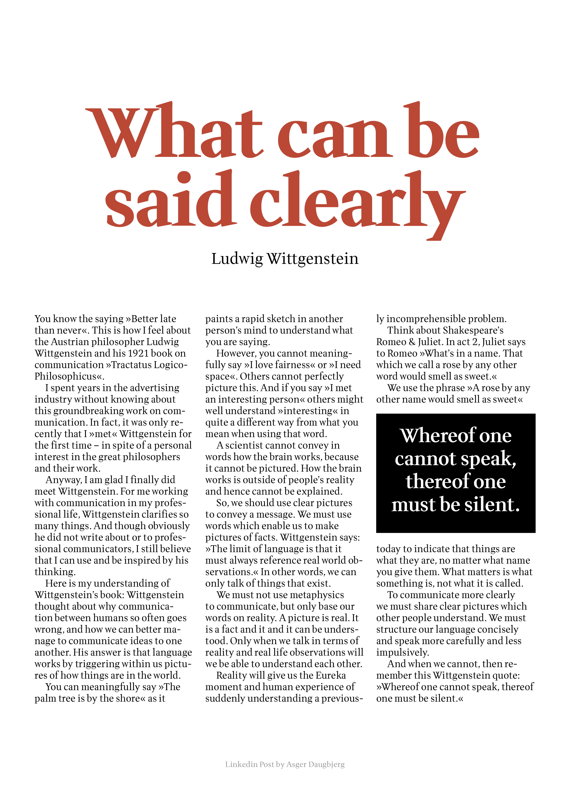
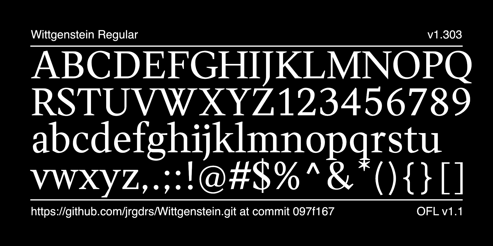
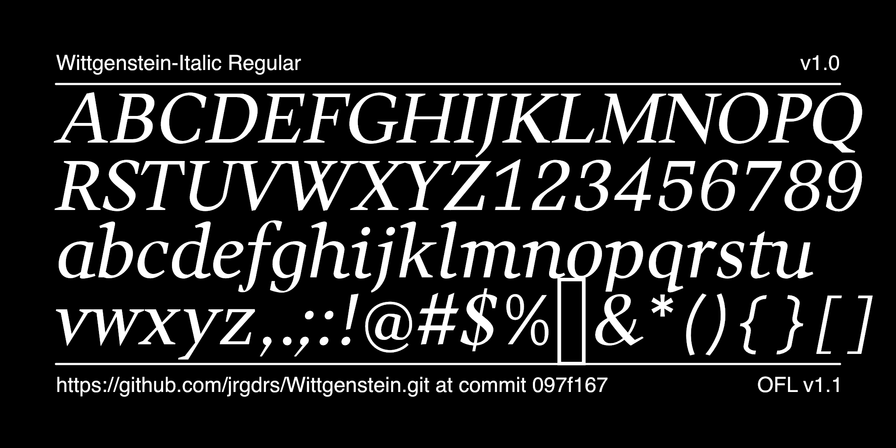
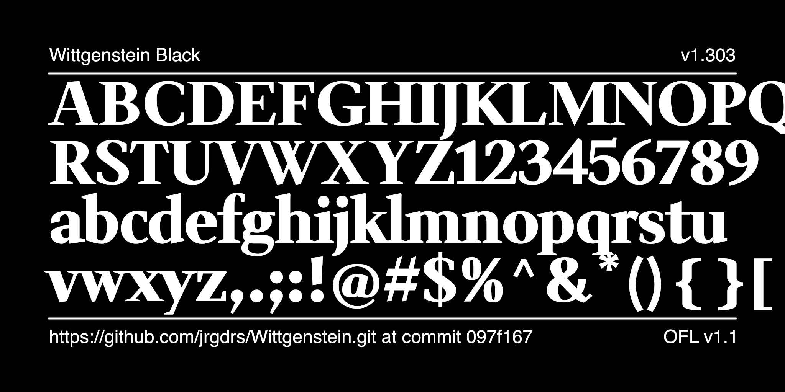

# Wittgenstein Font Project

[![][Fontbakery]](https://jrgdrs.github.io/Wittgenstein/fontbakery/fontbakery-report.html)
[![][Universal]](https://jrgdrs.github.io/Wittgenstein/fontbakery/fontbakery-report.html)
[![][GF Profile]](https://jrgdrs.github.io/Wittgenstein/fontbakery/fontbakery-report.html)
[![][Outline Correctness]](https://jrgdrs.github.io/Wittgenstein/fontbakery/fontbakery-report.html)
[![][Shaping]](https://jrgdrs.github.io/Wittgenstein/fontbakery/fontbakery-report.html)

[Fontbakery]: https://img.shields.io/endpoint?url=https%3A%2F%2Fraw.githubusercontent.com%2Fjrgdrs%2FWittgenstein%2Fgh-pages%2Fbadges%2Foverall.json
[GF Profile]: https://img.shields.io/endpoint?url=https%3A%2F%2Fraw.githubusercontent.com%2Fjrgdrs%2FWittgenstein%2Fgh-pages%2Fbadges%2FGoogleFonts.json
[Outline Correctness]: https://img.shields.io/endpoint?url=https%3A%2F%2Fraw.githubusercontent.com%2Fjrgdrs%2FWittgenstein%2Fgh-pages%2Fbadges%2FOutlineCorrectnessChecks.json
[Shaping]: https://img.shields.io/endpoint?url=https%3A%2F%2Fraw.githubusercontent.com%2Fjrgdrs%2FWittgenstein%2Fgh-pages%2Fbadges%2FShapingChecks.json
[Universal]: https://img.shields.io/endpoint?url=https%3A%2F%2Fraw.githubusercontent.com%2Fjrgdrs%2FWittgenstein%2Fgh-pages%2Fbadges%2FUniversal.json

The font interprets the serifs with clear, sharp forms. Based on the quote from Ludwig Wittgenstein that what can be said can be said clearly, it bears his name. The style consists of a normal and a bold version, which can be expanded over time.

## Building

Fonts are built automatically by GitHub Actions - take a look in the "Actions" tab for the latest build.

If you want to build fonts manually on your own computer:

* `make build` will produce font files.
* `make test` will run [FontBakery](https://github.com/googlefonts/fontbakery)'s quality assurance tests.
* `make proof` will generate HTML proof files.

The proof files and QA tests are also available automatically via GitHub Actions - look at https://jrgdrs.github.io/Wittgenstein.

## License

This Font Software is licensed under the SIL Open Font License, Version 1.1.
This license is available with a FAQ at
https://scripts.sil.org/OFL

## Repository Layout

This font repository structure is inspired by [Unified Font Repository v0.3](https://github.com/unified-font-repository/Unified-Font-Repository), modified for the Google Fonts workflow.
