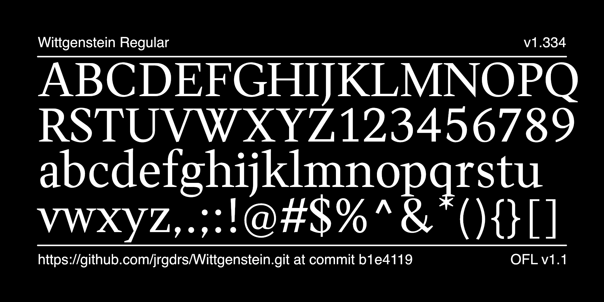
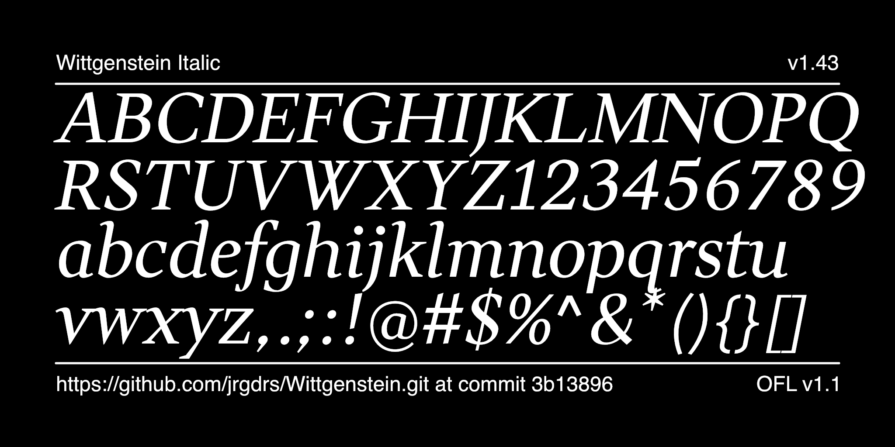
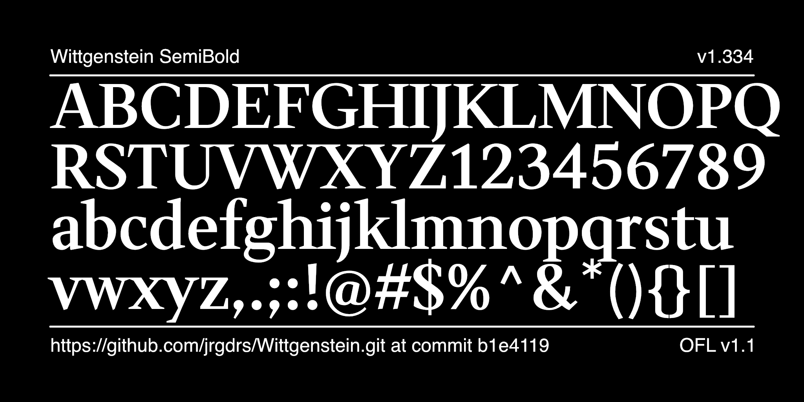
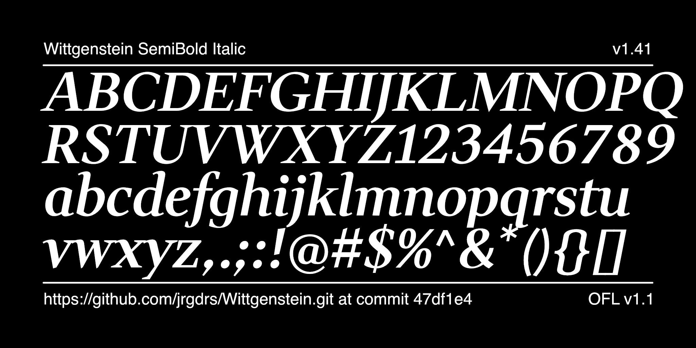
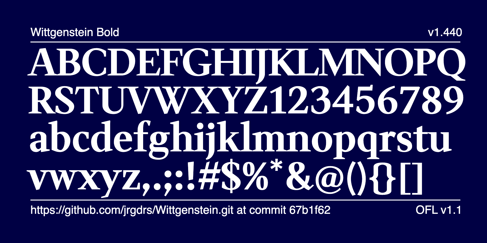
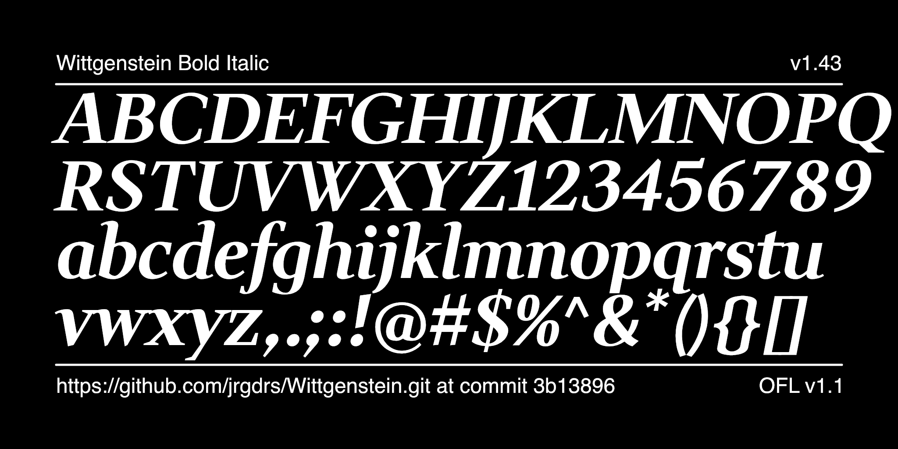
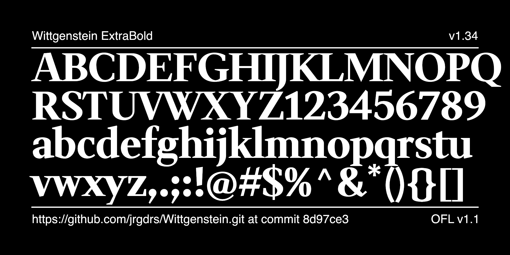
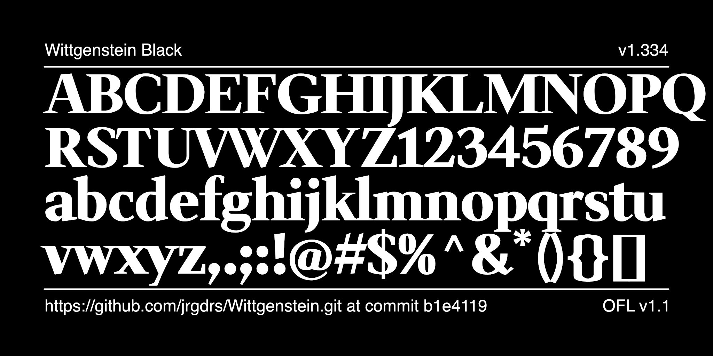
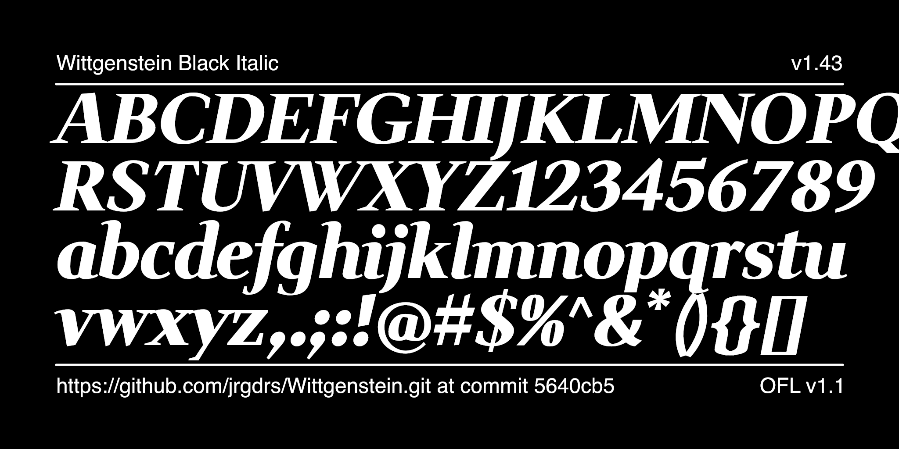

# Wittgenstein Font Project

[![][Fontbakery]](https://jrgdrs.github.io/Wittgenstein/fontbakery/fontbakery-report.html)
[![][Universal]](https://jrgdrs.github.io/Wittgenstein/fontbakery/fontbakery-report.html)
[![][GF Profile]](https://jrgdrs.github.io/Wittgenstein/fontbakery/fontbakery-report.html)
[![][Outline Correctness]](https://jrgdrs.github.io/Wittgenstein/fontbakery/fontbakery-report.html)
[![][Shaping]](https://jrgdrs.github.io/Wittgenstein/fontbakery/fontbakery-report.html)

[Fontbakery]: https://img.shields.io/endpoint?url=https%3A%2F%2Fraw.githubusercontent.com%2Fjrgdrs%2FWittgenstein%2Fgh-pages%2Fbadges%2Foverall.json
[GF Profile]: https://img.shields.io/endpoint?url=https%3A%2F%2Fraw.githubusercontent.com%2Fjrgdrs%2FWittgenstein%2Fgh-pages%2Fbadges%2FGoogleFonts.json
[Outline Correctness]: https://img.shields.io/endpoint?url=https%3A%2F%2Fraw.githubusercontent.com%2Fjrgdrs%2FWittgenstein%2Fgh-pages%2Fbadges%2FOutlineCorrectnessChecks.json
[Shaping]: https://img.shields.io/endpoint?url=https%3A%2F%2Fraw.githubusercontent.com%2Fjrgdrs%2FWittgenstein%2Fgh-pages%2Fbadges%2FShapingChecks.json
[Universal]: https://img.shields.io/endpoint?url=https%3A%2F%2Fraw.githubusercontent.com%2Fjrgdrs%2FWittgenstein%2Fgh-pages%2Fbadges%2FUniversal.json

The font interprets the serifs with clear, sharp forms. Based on the quote from Ludwig Wittgenstein that what can be said can be said clearly, it bears his name. The style consists of different weights also in italic, prepared as variable fonts as weight axis.

Find specimen and language samples as pdf file in subfolder documentation.

## License

This Font Software is licensed under the SIL Open Font License, Version 1.1.
This license is available with a FAQ at
https://openfontlicense.org

## Repository Layout

This font repository structure is inspired by [Unified Font Repository v0.3](https://github.com/unified-font-repository/Unified-Font-Repository), modified for the Google Fonts workflow.

## Build

run ./make.sh

## Version

1.500 on May 31st 2024
